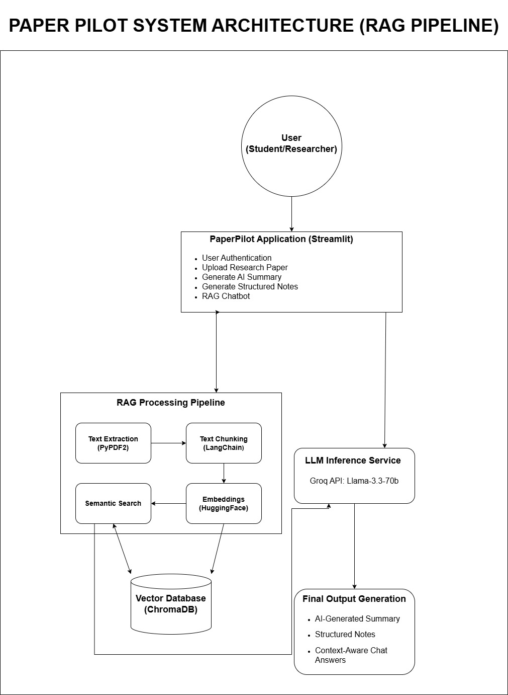

#  PaperPilot – GenAI Research Paper Assistant

##  Overview

PaperPilot is a web-based AI-powered research assistant designed to help students and researchers extract meaningful insights from lengthy research papers.

By leveraging **Retrieval-Augmented Generation (RAG)**, the system provides:
* Context-aware answers
* Concise summaries
* Structured notes

All outputs are generated directly from uploaded PDF documents, ensuring accuracy and relevance.

---

##  Key Features

* **Secure Authentication:** Provides safe login and signup functionality.
* **PDF Processing:** Enables seamless uploading and parsing of research papers.
* **AI Summarization:** Generates quick and concise summaries of documents.
* **Structured Notes:** Automatically extracts key sections such as:

  * Introduction
  * Key Points
  * Conclusion
* **RAG Chatbot:** Allows users to ask questions, with answers generated strictly based on the uploaded document context.

---

##  Tech Stack

* **Frontend & UI:** Streamlit
* **Backend Pipeline:** Python, LangChain Framework
* **LLM Engine:** Groq API (LLaMA 3.3 – 70B Versatile)
* **Vector Database:** ChromaDB (for local semantic search)
* **Embeddings:** HuggingFace Models

---

##  System Architecture

---

## 👥 Team Members (Team-1)

* **Harish Kumar**
* **Kalpana Bhardwaj**
* **Prakriti**
* **Vansh**

**Faculty Superviser:** Mr. Saqib
**Mentor:** Mr. Zuber

**Institution:** Jagannath University

---
